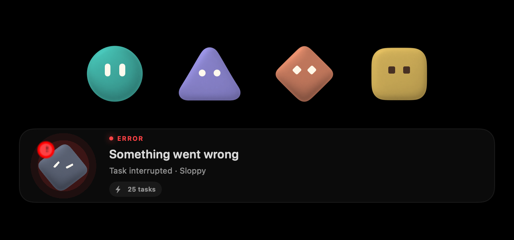

# Bot redesign verification

The new artwork is a development-generated PNG catalog. Agent identity is assigned automatically; avatar generation by users is removed. See [asset paths and imagegen prompts](bot-assets.md).

## Passed

- Native focused tests: 25 tests covering identity, transparent PNG resource loading, actual SwiftUI rendering, SpriteKit texture switching, error/input indicators, task/run agent selection, cursor tracking, cyclic blinking, poke expressions, Reduced Motion, palette caching and existing notch behavior.
- Core focused tests: 12 tests covering automatic assignment, legacy artwork migration with preserved stats/XP, progression, HTTP 410 for the retired generator, rejection of retired drafts, and persistence of the independently chosen random palette.
- Dashboard asset tests: three tests checking UTF-8 identity fixtures, RGBA PNGs, and byte-for-byte equality with native assets, palettes and facial pose fixtures.
- Dashboard `npm run typecheck` and `npm run build`.
- Release builds of `sloppy` and `SloppyNode` on macOS.
- Browser component preview: all four PNGs display at portrait and icon sizes; changing the form's agent ID from `a` to `b` changes the companion from circle to triangle. The form has no avatar prompt/model/regeneration controls. The browser preview also displays all eight colors and six facial poses; real repeated clicks were verified to change the expression to surprise and happy curved eyes.

The native preview is rendered from the real SwiftUI components. SpriteKit's Metal layer is captured through `SKView.texture(from:crop:)` and placed at its actual frame because AppKit `cacheDisplay` omits that layer. This is component-render evidence, not an installed-app or iOS-device test.

## Full-suite limits

The earlier complete native run executed 650 tests and recorded 100 issues. Pet/notch tests passed. Other failures include source-text expectations for navigation, tabs, and composer layouts, plus existing workspace/transcript UI scenarios.

The earlier complete Core run executed 2009 tests and recorded 25 issues. Pet tests passed. Other failures include session-title expectations, runtime/tool/planner timeouts, relay authentication timeouts, terminal/process cleanup, Visor task progression and FAL cancellation.

Those failures were not repaired as part of the avatar redesign. A pristine baseline rerun was not performed, so the full suites are not claimed to be green.

Local diagnostic logs are in `/tmp/sloppy-bot-client-focused.log`, `/tmp/sloppy-bot-client-full-tests.log`, `/tmp/sloppy-bot-core-final-tests.log`, `/tmp/sloppy-bot-core-full-tests.log`, `/tmp/sloppy-bot-core-release.log`, `/tmp/sloppy-bot-node-release.log`, and `/tmp/sloppy-bot-dashboard-*.log`.

## Animated eye/color follow-up

The body PNGs were edited with built-in imagegen into neutral body layers without eyes. Separate eyes now animate in SpriteKit and Dashboard previews. Runtime tinting uses the saved `paletteId`; the same shape can use any of eight colors, and contrast-aware eye colors follow the palette. A real persisted-agent test verifies repeated reads keep the palette. Legacy wire JSON without a palette still decodes.

A 160-frame GIF is captured directly from the native SpriteKit scene, showing gaze tracking, a blink, surprise, happy closed eyes, angry eyes, error, thinking and needs-input. Frames are flattened onto black only for GIF preview to avoid transparency trails; the shipped PNGs and cached runtime body textures retain alpha.

Final focused follow-up checks passed (25 native, 12 Core, 3 Dashboard); Dashboard typecheck/build and release builds of sloppy/SloppyNode passed. Full suites were not rerun for the eye/color follow-up; the earlier unrelated failures above remain an overall verification limit. iOS/device behavior is not claimed as verified.

Follow-up logs: `/tmp/sloppy-bot-eyes-native.log`, `/tmp/sloppy-bot-eyes-core-tests.log`, `/tmp/sloppy-bot-eyes-web-*.log`, `/tmp/sloppy-bot-eyes-core-release.log`, `/tmp/sloppy-bot-eyes-node-release.log`.
